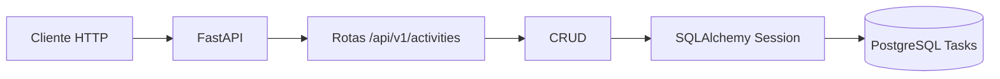

# Apresentação do sistema

---

## 1. Objetivo

Criar uma API simples e organizada para gerenciar atividades com CRUD completo, banco PostgreSQL e migrações controladas.

---

## 2. Stack usada

- FastAPI
- SQLAlchemy 2.0
- Alembic
- PostgreSQL 16
- Uvicorn

---

## 3. Arquitetura



---

## 4. Fluxo de criação

1. O cliente envia um `POST /activities`.
2. A camada de schema valida os dados.
3. O CRUD gera o hash do `id`.
4. O SQLAlchemy grava o registro no PostgreSQL.
5. A API devolve a atividade criada.

---

## 5. Estrutura da atividade

- `id`
- `titulo`
- `agente_responsavel`
- `data_inicio`
- `data_conclusao`
- `descricao`
- `status`

---

## 6. Rotas

- `POST /api/v1/activities`
- `GET /api/v1/activities`
- `GET /api/v1/activities/{activity_id}`
- `PATCH /api/v1/activities/{activity_id}`
- `DELETE /api/v1/activities/{activity_id}`

---

## 7. Banco de dados

- Banco: `Tasks`
- Tabela principal: `activities`
- Migração inicial pronta no Alembic

---

## 8. Como rodar

```bash
cp .env.example .env
docker compose up --build
```

Depois, acessar:

- `http://localhost:8000/docs`
- `http://localhost:8000/api/v1/health`

---

## 9. Ponto forte

O projeto fica fácil de manter porque separa:

- rota
- schema
- CRUD
- modelo
- configuração
- migração

---

## 10. Resultado

Uma base pronta para crescer sem virar bagunça.
